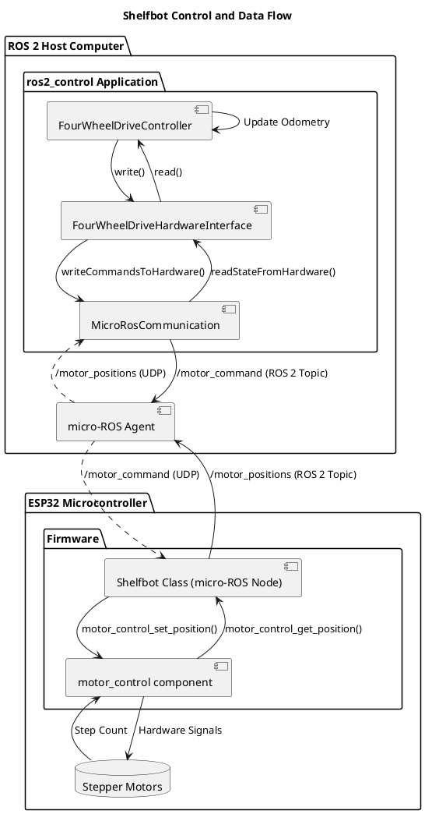

# Shelfbot Firmware

This firmware runs on an ESP32-WROOM-32 and serves as the real-time hardware interface for the Shelfbot, a ROS 2 (Humble) based robotic system. It is written in C++ and structured as a set of ESP-IDF components, with the core logic encapsulated in a `Shelfbot` class.

---

## Architecture

The Shelfbot control system is a distributed system that cleanly separates high-level control logic from low-level hardware management. This is achieved through three main components that communicate over a Wi-Fi network.

1.  **ROS 2 Host Application (`shelfbot`)**: The "brain" of the robot, running on a host computer. It uses the `ros2_control` framework for a standardized approach to robot control. This includes controllers (like `FourWheelDriveController`) for tasks like odometry and motion, and a hardware interface (`FourWheelDriveHardwareInterface`) that abstracts the physical robot.
2.  **micro-ROS Agent**: A lightweight bridge that relays messages between the main ROS 2 network (DDS) and the micro-ROS client on the ESP32 (RTPS over UDP).
3.  **ESP32 Firmware (This Repository)**: The low-level C++ controller that directly manages the stepper motors and other hardware. It acts as a micro-ROS node, exposing its capabilities as ROS 2 topics, and effectively serving as the "muscles" of the robot.

### Control and Data Flow Diagram

The following diagram illustrates how a high-level command from the `ros2_control` system flows down to the hardware, and how position feedback flows back up to update the robot's state.

### Firmware Architecture

The firmware is organized into modular, reusable ESP-IDF components to promote separation of concerns:

*   **`main`**: A minimal entry point. Its sole responsibility is to instantiate the `Shelfbot` class and start the application.
*   **`shelfbot`**: The core application component. The `Shelfbot` C++ class within this component orchestrates all major functions: network initialization, mDNS discovery, SNTP time synchronization, and managing the micro-ROS task.
*   **`motor_control`**: A hardware abstraction layer for the stepper motors. It uses the `FastAccelStepper` library to provide a simple API for motor control.
*   **`led_control`**: A simple hardware abstraction for the ESP32's built-in LED.
*   **`wifi_station`**: Manages the Wi-Fi connection.
*   **`http_server`**: Provides a REST API for basic troubleshooting and manual control.

---

## Hardware Resource Allocation

The ESP32 has a limited number of GPIO pins and hardware peripherals. The following table details how they are used by the firmware components.

| Component | Function | Resource | Pin/ID | Notes |
| :--- | :--- | :--- | :--- | :--- |
| **`motor_control`** | Motor 0 | GPIO (PUL/DIR) | 27, 26 | **Should be changed:** These are ADC2 pins, which can be unreliable when Wi-Fi is active. |
| | Motor 1 | GPIO (PUL/DIR) | 14, 12 | **Should be changed:** ADC2 pins. GPIO 12 is also a strapping pin and can affect boot. |
| | Motor 2 | GPIO (PUL/DIR) | 13, 15 | **Should be changed:** ADC2 pins. GPIO 15 is also a strapping pin and can affect boot. |
| | Motor 3 | GPIO (PUL/DIR) | 4, 16 | **Should be changed:** GPIO 4 is an ADC2 pin. |
| | Motor 4 | GPIO (PUL/DIR) | 17, 5 | **Potential Issue:** GPIO 5 is a strapping pin and must be HIGH at boot. |
| | Motor 5 | GPIO (PUL/DIR) | 18, 19 | Safe to use. |
| | Stepper Engine | RMT Channels | 0, 1, 2, 3, 4, 5 | Safe to use. `FastAccelStepper` uses 6 of the 8 available RMT channels. |
| **`sensor_control`** | Sensor 0 | GPIO (Trig/Echo) | 21, 34 | Safe to use. GPIO 34 is input-only. |
| | Sensor 1 | GPIO (Trig/Echo) | 22, 35 | Safe to use. GPIO 35 is input-only. |
| | Sensor 2 | GPIO (Trig/Echo) | 23, 36 | Safe to use. GPIO 36 is input-only. |
| | Sensor 3 | GPIO (Trig/Echo) | 32, 39 | Safe to use. GPIO 39 is input-only. |
| | Sensor Timeout | Hardware Timer | GPTimer 0 | Safe to use. A single shared timer is used for all sensors, leaving 3 timers free. |
| | Echo Interrupt | GPIO ISR | Pins 34, 35, 36, 39 | Safe to use. Uses the global GPIO ISR service. |
| **`led_control`** | Onboard LED | GPIO | 2 | Safe to use. |
| **`wifi_station`** | Wi-Fi | Peripheral | N/A | **Implicit Conflict:** The Wi-Fi peripheral interferes with all pins on the ADC2 controller. |

### Key Hardware Issues

1.  **ADC2 and Wi-Fi Conflict:** Many of the GPIO pins assigned to the motors are controlled by the `ADC2` peripheral. The ESP32 documentation warns that these pins cannot be used reliably while the Wi-Fi is active. This can lead to erratic motor behavior or stalls. For future hardware revisions, it is strongly recommended to move motor control pins to non-ADC2 GPIOs.

---

## ROS 2 Interface

The firmware creates a single ROS 2 node named `shelfbot_firmware`.

### Published Topics

| Topic | Message Type | Description |
| :--- | :--- | :--- |
| `/shelfbot_firmware/heartbeat` | `std_msgs/msg/Int32` | A counter published every 2 seconds to indicate the firmware is alive. |
| `/shelfbot_firmware/motor_positions` | `std_msgs/msg/Float32MultiArray` | Publishes the current position of each motor in **radians**. Used as feedback for `ros2_control`. |
| `/shelfbot_firmware/distance_sensors`| `std_msgs/msg/Float32MultiArray` | Publishes readings from distance sensors. |
| `/shelfbot_firmware/led_state` | `std_msgs/msg/Bool` | Publishes the current state of the onboard LED. |

### Subscribed Topics

| Topic | Message Type | Description |
| :--- | :--- | :--- |
| `/shelfbot_firmware/led` | `std_msgs/msg/Bool` | Controls the state of the ESP32's built-in blue LED. `true` turns the LED on, `false` turns it off. |
| `/shelfbot_firmware/motor_command` | `std_msgs/msg/Float32MultiArray` | Commands the motors to specific positions. The `data` field should be an array of target positions in **radians**. This is the primary topic used by `ros2_control`. |
| `/shelfbot_firmware/set_speed` | `std_msgs/msg/Float32MultiArray` | Sets the speed for each motor individually in **Hz (steps/sec)**. Useful for testing and configuration. |

---

## Testing and Troubleshooting

### Testing Motor Control

This test verifies that you can command the motors to specific positions, bypassing `ros2_control`.

| Action | Command | Expected Result |
| :--- | :--- | :--- |
| **1. Move Motor 0 to 90°** | `ros2 topic pub --once /shelfbot_firmware/motor_command std_msgs/msg/Float32MultiArray "{data: [1.57]}"` | Motor 0 moves to the 90-degree position. Serial monitor shows: `I (xxxx) shelfbot: Motor 0 command: 1.57 rad` |
| **2. Move Motors 0 & 1** | `ros2 topic pub --once /shelfbot_firmware/motor_command std_msgs/msg/Float32MultiArray "{data: [1.57, -1.57]}"` | Motor 0 moves to +90° and Motor 1 moves to -90°. Serial monitor shows logs for both motors. |
| **3. Return all to Zero** | `ros2 topic pub --once /shelfbot_firmware/motor_command std_msgs/msg/Float32MultiArray "{data: [0.0, 0.0, 0.0, 0.0, 0.0, 0.0]}"` | All motors return to their zero position. |

**Troubleshooting:**
*   **Motors do not move:** Verify motor power supply and wiring. Check the serial monitor for any error messages.
*   **Moves to wrong position:** Ensure your high-level application is sending commands in **radians**, not degrees.

### Testing the LED Control

This test verifies basic two-way communication with the ESP32.

| Action | Command | Expected Result |
| :--- | :--- | :--- |
| **1. Turn LED ON** | `ros2 topic pub --once /shelfbot_firmware/led std_msgs/msg/Bool "data: true"` | The blue LED on the ESP32 module turns ON. Serial monitor shows: `I (xxxx) shelfbot: LED command received: ON` |
| **2. Turn LED OFF** | `ros2 topic pub --once /shelfbot_firmware/led std_msgs/msg/Bool "data: false"` | The blue LED on the ESP32 module turns OFF. Serial monitor shows: `I (xxxx) shelfbot: LED command received: OFF` |

**Troubleshooting:**
*   **Command fails or hangs:** Ensure the micro-ROS agent is running and the ESP32 is connected to Wi-Fi.
*   **No serial log message:** Verify the ESP32 is powered and the `idf.py monitor` is running.

---

## Building the Firmware

This project uses the ESP-IDF build system.

1.  **Set up ESP-IDF**: Ensure you have the ESP-IDF environment configured.
2.  **Configure**: Run `idf.py menuconfig` to set Wi-Fi credentials and other project settings.
3.  **Build**: Run `idf.py build`.
4.  **Flash**: Run `idf.py flash` to upload the firmware to the ESP32.
5.  **Monitor**: Run `idf.py monitor` to view the serial output.